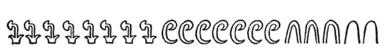

# 古人如何表示大数？用多少沙子才能将宇宙填满？
## 有趣的古人故事
曾经有这么个故事，讲的是两个匈牙利贵族玩数数字的游戏，谁数的数字大谁就赢。

“那你先来吧！”一个贵族说。

于是另一个贵族绞尽脑汁，想了好几分钟，最终报出了他能想到的那个最大的数字：“3！”

接下来轮到第一个人费脑筋了，于是他冥思苦想了一刻钟， 然后无奈地说：“你赢啦！”

很显然这两个贵族智商不太高，况且这个故事很可能只是一个调侃罢了，真实发生的概率不大。但这种对话却真的有可能发生在霍屯督人1之中。如今我们通过一些非洲探险家得知，霍屯督人的字典中不存在比3更大的数字。所以如果你问他们家里有多少个儿子或是杀死过多少个敌人，如果数字大于3，他会告诉你“很多个”。因此从数数方面来说，霍屯督人连我们幼儿园的小娃娃都不如，毕竟就连小娃娃都能数到10呢！

## 古埃及人计数方式
> 古埃及人没有零的概念，他们记述从1到9都用画竖的方式来代表。
>1就是一竖，9就是九竖，从10开始就用物品来代替了。
>10是一段绳子，而一卷绳子表示100。
>荷花代表1000，一根手指代表10000，蝌蚪代表100000，而一个举着双手的人代表着1000000。
>在表示5000000的时候，古埃及人并不是用5道竖加一个举手的人，而是把那个举手的人重复画5次。

https://blog.csdn.net/butterfly5211314/article/details/87900138
https://www.jianshu.com/p/96c4a9fc66b4

## 参考链接

- [古埃及人的计数方式](https://zhidao.baidu.com/question/989354720663643899.html)